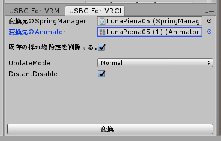
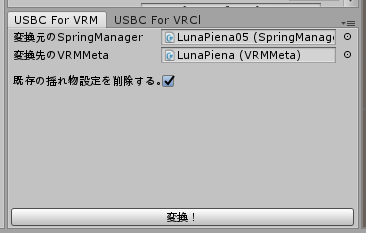
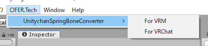
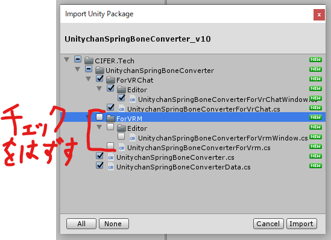
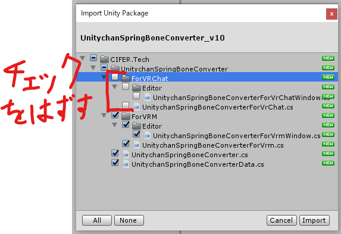

# UnitychanSpringBoneConverter
UnitychanSpringBoneを使用しているモデルの揺れ物パラメータを、特定の揺れ物スクリプトのパラメータに変換するエディタ拡張

  
  

## 概要
UnityChanSpringBoneは角度制限などの機能がある優秀な揺れ物スクリプトですが、特定のアプリケーションやサービスでは使用できないことがあります。  
その時には揺れ物スクリプトを変更してパラメータを調整しなければならないのですが、イチから手作業でセットアップするのは大変です。  
そこで手軽にセットアップが行えるよう、UnityChanSpringBoneから特定の揺れ物スクリプトへパラメータを変換してくれるエディタ拡張を作りました。  
現在はVRChatで使用されているDynamicBoneと、VRMに同梱されているVRMSpringBoneにのみ対応しています。  
要望が多ければ他揺れ物スクリプトにも対応します。  

## 使い方
1. [Booth](https://cifertech.booth.pm/items/1720221)からUnityPackageをダウンロードしてインポートする。
2. プロジェクトのScripting Runtime Versionを __.NET4.x（もしくはそれ以上）__ にする。
3. メニューバーより __CIFER.Tech -> UnitychanSpringBoneConverter -> （変換先）__ を選択する。
4. 上側に変換元となるモデルのSpringManagerを、下側に変換先となるモデルの Animator / VRMMeta を登録する。
5. 一番下に出現する『変換！』ボタンを押下する。

## 動作環境
- Unity2018.4.20f1
  - Scripting Runtime Version .NET 4.x Equivalent
- [UnitychanSpringBone](https://github.com/unity3d-jp/UnityChanSpringBone)

## 変換先揺れ物スクリプト（必要なもののみ用意ください）
- [UniVRM（VRMSpringBone）](https://github.com/vrm-c/UniVRM)
- [DynamicBone](https://assetstore.unity.com/packages/tools/animation/dynamic-bone-16743)

## FAQ
### 対応している変換先揺れ物スクリプトは何ですか？
現在はVRChatで使用されているDynamicBoneと、VRMに同梱されているVRMSpringBoneにのみ対応しています。  
要望が多ければ他揺れ物スクリプトにも対応します。

### DynamicBoneとVRMSpringBoneの両方が必要ですか？
いいえ。アセットインポート時にインポートするフォルダを選択することで、どちらかのみでも動作するよう作られています。
- DynamicBoneのみ使用する場合  
ForVRMフォルダのチェックを外してインポートしてください。  

- VRMSpringBoneのみ使用する場合  
ForVRChatフォルダのチェックを外してインポートしてください。  

### ウィンドウにある設定の意味は？
ウィンドウにある設定の名前とその説明を以下に残します。  
- 既存の揺れ物設定を削除する。  
  TRUEの場合、変換先モデルにアタッチされている揺れ物スクリプトを削除し、新規にアタッチし直します。  
  既に揺れを設定している場合や既存の設定を削除したくない場合は、FALSEにしてください。
- UpdateMode（ForVRChatのみ）  
  揺れの計算タイミングを指定します。  
  DynamicBoneにある同名のプロパティに設定が反映されます。
- DistantDisable（ForVRChatのみ）  
  TRUEの場合、揺れ物オブジェクトがカメラや参照オブジェクトから遠いと、揺れの計算が無効化されます。  
  DynamicBoneにある同名のプロパティに設定が反映されます。

## ライセンス
本リポジトリは[MITライセンス](LICENSE)の下で公開しています。

本リポジトリにはMITライセンスの下に提供されている[UniVRM](https://github.com/vrm-c/UniVRM/blob/master/LICENSE.txt)が含まれています。  
本リポジトリにはMITライセンスの下に提供されている[UnitychanSpringBone](https://github.com/unity3d-jp/UnityChanSpringBone/blob/master/LICENSE)が含まれています。  
これらのコンテンツを利用される場合は、該当リポジトリのライセンスもしくは同梱しているライセンスファイルに従ってください。  
